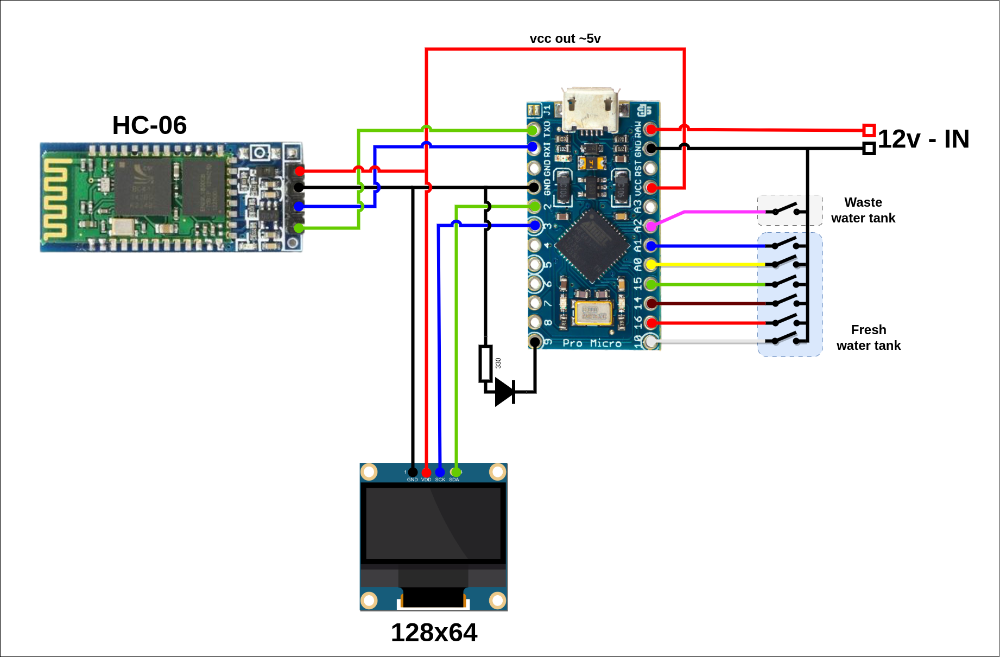

# Arduino Water Gauge

A simple digital gauge to monitor the water level of two tanks:

- Fresh water (6 static levels)
- Waste water (Full tank indicator)

## Description

The project take advantage of water conductivity to detect the amount of water present in the tank. When the water hit the two probes, the circuit is closed and the pin detect the voltage difference.
Pins are connected to GROUND using the PULLUP mode, to semplify the circuit.
The bluetooth module enable to monitor the tanks remotely, this can be useful when filling the fresh water tank, if the gauge is far from the water inlet (or send the data to another device).

### Hardware

- Sparkfun Pro Micro (or any compatible Arduino Board)
- Bluetooth module HC-06
- I2C Oled Display, 128x56
- led diode
- 330k resistor
- jumper wires
- prototyping breadboard

### Software

The project is built with Platformio (https://platformio.org/)
If you are using the Arduino IDE, just copy the main.cpp file, rename it as .ino and import the required libraries.

### Schematics

| HC-06 | Arduino |
| :---- | :------ |
| `Rx`  | `Tx`    |
| `Tx`  | `Rx`    |
| `Vcc` | `Vcc`   |
| `Gnd` | `Gnd`   |

| I2C Oled  | Arduino (Sparkfun Pro Micro) |
| :-------- | :--------------------------- |
| `Sck`     | `3 (Scl)`                    |
| `Sda`     | `2 (Sda)`                    |
| `Vcc/Vdd` | `Vcc`                        |
| `Gnd`     | `Gnd`                        |

### Pro Micro pinout reference

